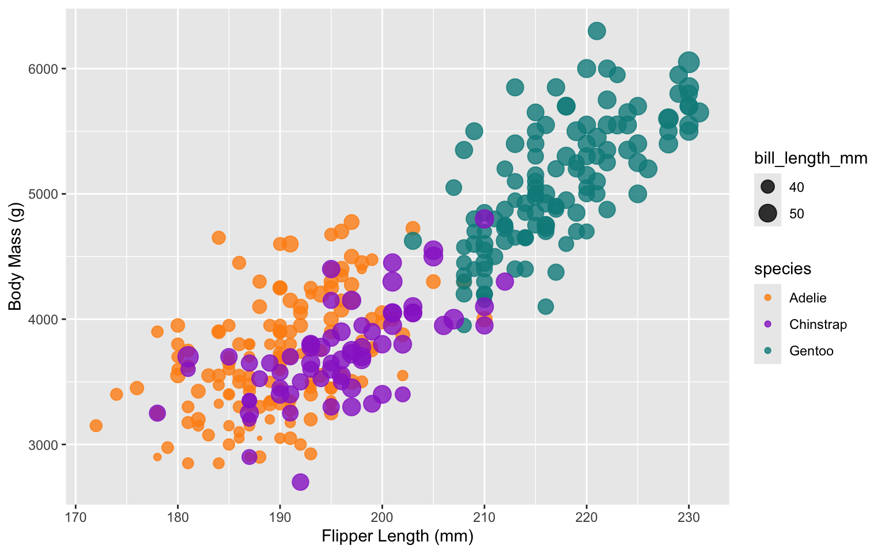
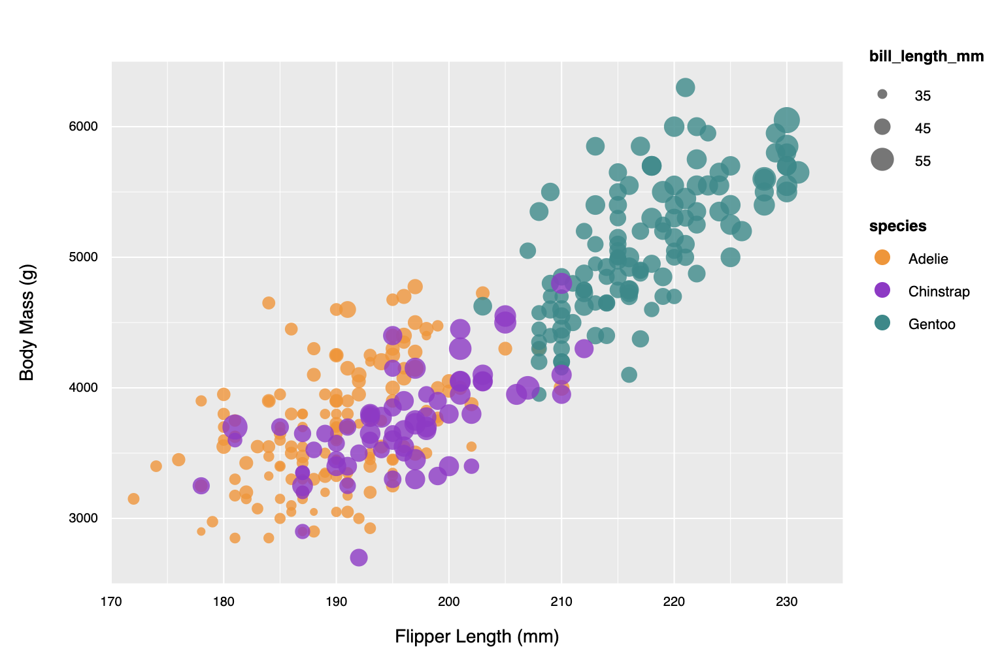
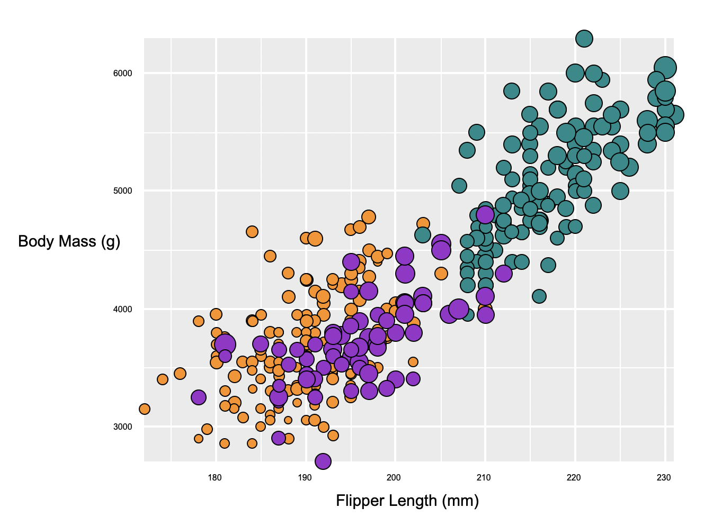
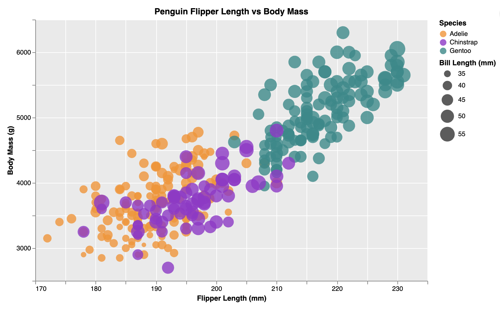
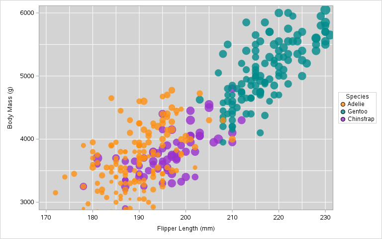

# Penguin Data Visualization - 5 Ways

This project explores the visualization of the Palmer Penguins dataset (`penglings.csv`) using five different technologies. The goal was to create a consistent scatter plot across all platforms, mapping Flipper Length to the x-axis, Body Mass to the y-axis, Species to color, and Bill Length to point size.

## 1. R + ggplot2
The baseline visualization was created using R and the `ggplot2` library. This method provided the design standard for the subsequent implementations. I found it simple and easy to use. This provides middle ground flexibility with some built in functionalities and also some ability to add custom features and styling. However, R is a less common language, which is a major pitfall of this method.

- **Technical Achievement:** Used the `guides()` function to explicitly control legend ordering, ensuring "Species" and "Bill Length" appeared in the correct order.
- **Design Achievement:** Implemented a custom color palette (`#fe9013`, `#9932cc`, `#018b8b`) and a clean grey background with white grid lines to set the project's visual standard.

## 2. D3.js
A web-based version built from scratch using SVG elements. This was harder to use and more verbose, but provided much greater control of each individual method compared to some other methods. You can edit almost every part of a chart with no limits, but there is less built in support for generating a graph or visualization with low effort.

- **Technical Achievement:** Implemented complex axis logic using `tickValues` and `tickFormat` to display labels only on major increments (every 10 for X, every 1000 for Y) while maintaining minor grid lines. Managed SVG layering to ensure grid lines remained behind the data points.
- **Design Achievement:** Replicated the `ggplot2` aesthetic exactly, including the specific grey background color and white grid line weights.

## 3. Python Turtle
A low-level, procedural approach to data visualization. Although it is easy to get started, it was very difficult to use because it isn't intended for representing any type of complex data and is primarily just a simple graphics and drawing option for people learning Python. I was unable to represent the opacity due to the simplicity of this program.

- **Technical Achievement:** Developed a custom coordinate scaling system to map raw data values (ranging from 170-230 for flipper length and 2700-6300 for body mass) to the pixel-based Turtle canvas.
- **Design Achievement:** Manually drew the background, axes, and labels using turtle movements, maintaining visual consistency with the high-level libraries.

## 4. Altair (Python)
A declarative statistical visualization library for Python. To me, this was a lot like using R + ggplot, because it had a lot of built in functionality with ease of use and flexibility. However, Python is more widely known than R so I see this as a more useful tool. This does lack the abiilty to change every minute detail/be as granular as some other tools like D3.

- **Technical Achievement:** Utilized Vega-Lite `labelExpr` to conditionally hide axis labels, achieving the specific "label every 10/1000" requirement while keeping the grid dense.
- **Design Achievement:** Used `configure_view` and `configure_axis` to globalize the theme, ensuring the plot area and grid matched the project's visual identity.

## 5. SAS
I tried using SAS because I know it is used often in industry (specifically research/biostats) due to its high level of standardization and compatibility, and I already had some familiarity. It seems like the issue is always that SAS makes it very easy to make a plot, but very hard to customize it to be less cookie-cutter. Also, it is extremely picky about input. The dataset given doesn't represent missing data as a . which is standard for SAS, so I had to fix that.

- **Technical Achievement:** Despite difficulties, I was able to change the size of each dot using bubble and was able to clean the data up to standard with SAS (which is very picky about input!)
- **Design Achievement:** I was able to use `styleattrs` and `bubble` to format the chart with a theme closely resembling the example, matching the project's visual identity as closely as possible.
